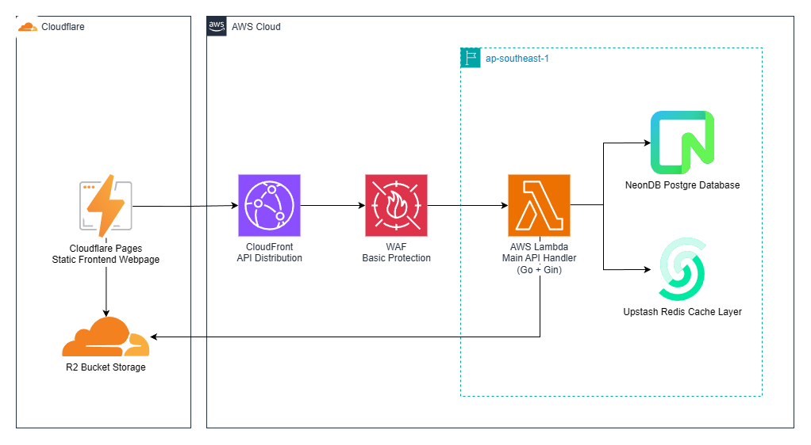

# Yaoyao-functions

[](https://github.com/hatohui/yaoyao-functions/actions/workflows/backend-cd.yml)

## General details

- Endpoint for [yaoyaoapi](https://api.yaoyaodinner.party)
- API for [yaoyao-dinner](https://yaoyaodinner.party)
- Runs on: Lambda serverless with gin http adapter
- Region: `ap-southeast-1`

## Project Architecture

### System Architecture

A serverless web app split into three layers: static frontend (SPA), API (edge + Lambda), and media delivery (Cloudinary).

Components

- Frontend: Static SPA on Cloudflare Pages; serves only static assets and calls APIs over HTTPS.
- API: CloudFront (with AWS WAF) as API CDN -> forwards to AWS Lambda (Go + Gin) in `ap-southeast-1`.
- Datastores: NeonDB (Postgres) for persistent relational data; Upstash Redis for cache/fast KV.
- Media: Cloudinary for uploads and CDN; backend provides signed upload params and clients upload directly.

Design principles

- Clear separation of delivery networks (Cloudflare Pages for frontend, CloudFront+WAF for API, Cloudinary CDN for images) to minimize latency, reduce backend load, and simplify scaling.
- Direct client uploads to Cloudinary (signed params) so media does not proxy through the backend.

### Diagram



## Project Structure

```yaml
.
├── backend/            # API (Go + Gin)
│   ├── build/          # Compiled binaries
│   ├── src/
│   │   ├── cmd/        # CLI commands (migrate, seed, server)
│   │   ├── common/     # Common constants and utilities
│   │   ├── config/     # Configuration files (database, redis, modules)
│   │   ├── modules/    # Feature modules
│   │   │   └── health/ # Health check module
│   │   └── status/     # HTTP status codes and responses
│   ├── .air.toml       # Air configuration for hot-reload
│   ├── docker-compose.yaml # Docker services configuration
│   ├── Dockerfile      # Application container definition
│   ├── go.mod          # Go module dependencies
│   └── main.go         # Application entry point
├── frontend/           # Vite + React + TypeScript SPA
│   ├── src/            # Application source
│   ├── public/         # Static assets
│   ├── package.json    # Scripts & deps
│   └── wrangler.toml   # Cloudflare Pages/Workers config
├── infra/              # Terraform infrastructure code
├── docs/               # Design & architecture docs
└── README.md           # This file
```

## Frontend (Vite + React + TypeScript)

The frontend is a Vite-powered React + TypeScript single-page application (uses Tailwind, GSAP, React Query, and i18n). It lives in the `frontend/` folder and is built into static assets (`dist/`) which are deployed to Cloudflare Pages/Workers (see `frontend/wrangler.toml`).

Key files and notes:

- `frontend/index.html` — SPA entry
- `frontend/src/` — application source (React + TypeScript)
- `frontend/package.json` — scripts and dependencies
- `frontend/wrangler.toml` — Cloudflare Pages / Workers asset config (`assets.directory = "dist"`) and production env vars (e.g. `VITE_API_URL`).

Useful scripts:

- `npm install` — install dependencies
- `npm run dev` — start Vite dev server (local development)
- `npm run build` — TypeScript build + Vite production build (outputs `dist/`)
- `npm run preview` — preview the production build locally

Running locally:

```bash
cd frontend
npm install
npm run dev
# To build and preview:
npm run build
npm run preview
```

Environment variables:

- Use Vite env vars prefixed with `VITE_` for runtime configuration (for example `VITE_API_URL`). Production values are set in `frontend/wrangler.toml` or your CI/CD pipeline.

## Prerequisites

Required for development:

- Go 1.20+ (GOPATH/GOBIN configured)
- Docker (You can also directly use this without go installed)

Optional (Production):

- AWS CLI v2 configured with credentials and region (`ap-southeast-1`)
- Git and access to the repository on GitHub
- Terraform 1.5+ for infrastructure provisioning

## Development prep

### 1. Clone the repository

Clone this repository to your device, then open this in your favored IDE

### 2. Create environment variables

Open the `.env.example`, copy everything into `.env` in the same root directory. If you don't have, create one.

Alternatively, you can use these commands:

- Linux / macOS:

```bash
cp .env.example .env
```

- Windows (PowerShell):

```powershell
Copy-Item -Path .env.example -Destination .env
```

- Windows (Command Prompt):

```cmd
copy .env.example .env
```

- Git Bash / WSL:

```bash
cp .env.example .env
```

Next, you only need to do the one that's more suitable for your operating system.

### Windows

If your operating system is Windows, you have two options for running the app locally:

- By Docker
- By Air (hot-reload development)

**Option 1: Using Docker**

Simply run:

```powershell
docker compose up
```

This will start all services (API, PostgreSQL, Redis) in containers.

**Option 2: Using Air (Hot-reload)**

First, ensure you have Air installed:

```powershell
go install github.com/air-verse/air@latest
```

Edit `.air.toml` so the build produces a Windows executable (main.exe). For example:

```toml
[build]
  cmd = "go build -o ./main.exe ./..."
  bin = "main.exe"
```

Then run the database and Redis services with Docker:

```powershell
docker compose up yaoyaodb yaoyaoredis
```

Or comment out the `yaoyaoapi` service and run:

```bash
docker compose up
```

In a separate terminal, start the API with Air:

```powershell
air
```

Air will watch for file changes, rebuild to `main.exe`, and restart your application automatically.

### Linux / macOS

Similar to Windows, you have two options:

**Option 1: Using Docker**

```bash
docker compose up
```

**Option 2: Using Air (Hot-reload)**

Install Air:

```bash
go install github.com/air-verse/air@latest
```

Start database and Redis:

```bash
docker compose up yaoyaodb yaoyaoredis
```

Or comment out the `yaoyaoapi` service and run:

```bash
docker compose up
```

In a separate terminal, start the API with Air:

```bash
air
```

## Running Database Migrations

After starting the database service, you need to run migrations to set up the database schema.

### Migrate (Non-destructive)

Run migrations to create/update database schema:

```bash
go run cmd/migrate/main.go
```

This command will:

- Connect to the database using your environment variables
- Auto-migrate all database models (accounts, categories, foods, orders, etc.)
- Seed initial data (languages, categories, tables, sample accounts)
- Safe to run multiple times - won't delete existing data

### Seed Data Only

Run only the seeding process (without migration):

```bash
go run cmd/seed/main.go
```

This command will:

- Seed languages, categories, tables, accounts, and sample people
- Safe to run multiple times - uses `FirstOrCreate` (idempotent)
- Useful when you only want to add initial data without re-running migrations

### Reset Database (Destructive)

```bash
go run cmd/reset/main.go
```

This command will:

- Prompt for confirmation (type 'yes')
- Drop all tables and delete all data
- Re-run migrations and seed fresh data

**Note:** Ensure your `DATABASE_URL` environment variable is correctly set before running migrations.

## Environment Variables

Key environment variables (see `.env.example` for full list):

- `DATABASE_URL` - PostgreSQL connection string
- `REDIS_URL` - Redis connection string
- `AWS_REGION` - AWS region for Lambda deployment
- `PORT` - API server port (default: 8080)
